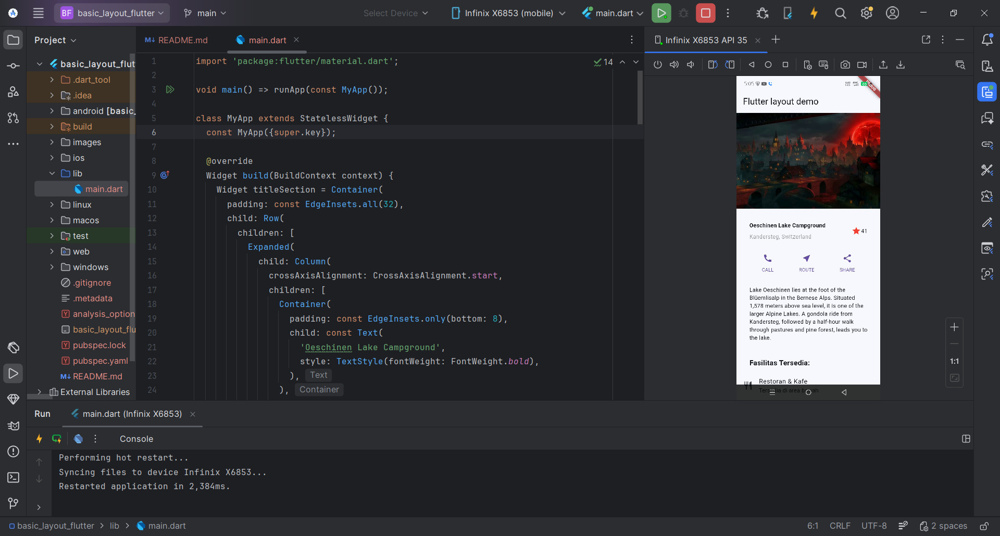
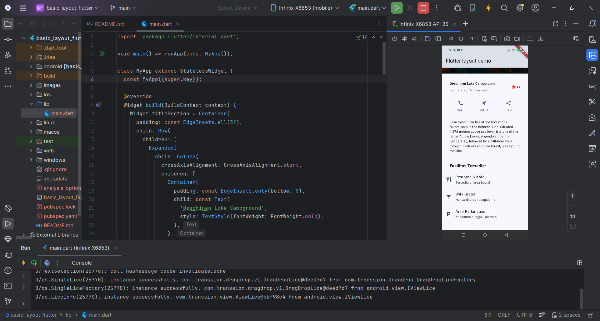

Nama: Fajar Kurnia Putra
Kelas: SIB 2F
Absen: 09
Nim: 244107060074
Perograman Mobile Jobsheet Flutter 2

Tugas 1, Kode Flutter ini membangun halaman antarmuka aplikasi informatif tentang sebuah tempat wisata yang seluruh layarnya dapat digulir (scroll) karena dibungkus menggunakan ListView. Secara visual, strukturnya tersusun berurutan dari atas ke bawah di dalam kerangka Scaffold, dimulai dengan gambar pemandangan utama, informasi judul lokasi beserta rating (titleSection), barisan tiga tombol aksi untuk interaksi (buttonSection), paragraf deskripsi tempat (textSection), dan diakhiri dengan rincian fasilitas tambahan (facilitiesList) yang tersusun rapi menggunakan widget ListTile. Secara keseluruhan, kode ini mempraktikkan penggabungan berbagai komponen tata letak dasar seperti Row, Column, dan Container untuk membentuk satu halaman profil wisata yang utuh, rapi, dan responsif.

