Nama: Fajar Kurnia Putra
Kelas: SIB 2F
Absen: 09
Nim: 244107060074
Perograman Mobile Jobsheet Flutter 2

Praktikum 5, Kode praktikum ini memandu membangun aplikasi Flutter multi-halaman pertama dengan menerapkan sistem Navigasi (Routing) dan Pemodelan Data terpisah. Prosesnya dimulai dengan membuat cetakan data Item dan mendaftarkan rute halaman ('/' untuk HomePage dan '/item' untuk ItemPage) di dalam file main.dart. Pada HomePage, daftar barang dibuat otomatis menggunakan ListView.builder yang membaca data dari List Item lalu dibentuk menjadi Card, yang mana setiap kartunya dibungkus dengan widget InkWell agar bisa mendeteksi klik (onTap). Saat diklik, perintah Navigator.pushNamed akan dijalankan, yang berfungsi sebagai "jembatan" untuk memindahkan layar pengguna dari halaman beranda ke halaman detail barang (ItemPage).

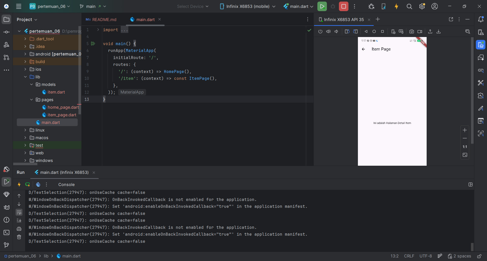

Tugas 2
Soal 1 & 2, Langkah ini mengajarkan mekanisme pengiriman dan penerimaan data antar halaman pada sistem navigasi Flutter. Pada home_page.dart, kita menambahkan properti arguments: item ke dalam fungsi Navigator.pushNamed, yang berfungsi ibarat "membungkus" data barang yang diklik untuk dibawa pergi ke halaman tujuan. Kemudian di halaman tujuan (item_page.dart), kita menggunakan ModalRoute.of(context)!.settings.arguments untuk "membuka bungkusan" tersebut dan mengubahnya kembali menjadi objek Item, sehingga data spesifik seperti nama dan harganya bisa dibaca dan ditampilkan secara dinamis di layar detail.

Soal 3, Disini saya menambahkan atribut imageUrl (foto via internet), stock (stok), dan rating ke dalam cetakan data Item. Pada layar utama, antarmuka diubah menggunakan GridView.builder dengan properti crossAxisCount: 2 agar produk tampil sejajar dalam dua kolom, lengkap dengan desain Card yang memuat gambar dan informasi rincian secara proporsional. Terakhir, pada halaman detail (item_page.dart), antarmukanya disusun ulang menggunakan kombinasi Image, Row, dan Column untuk menangkap serta mendisplai seluruh atribut baru tersebut dari arguments dengan rapi layaknya halaman deskripsi produk di toko online sesungguhnya.
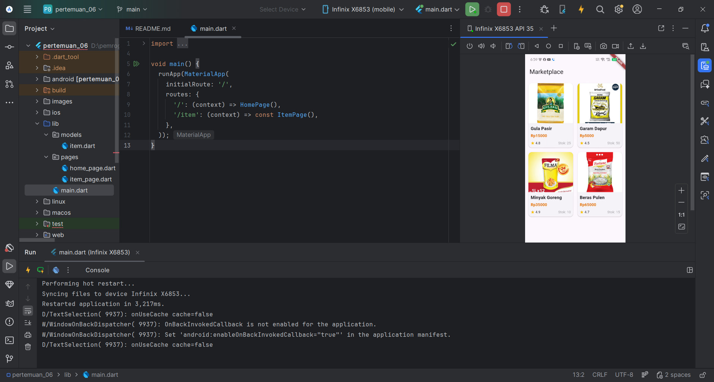
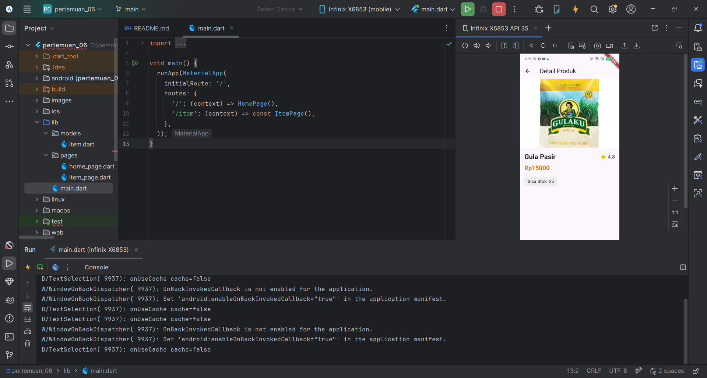
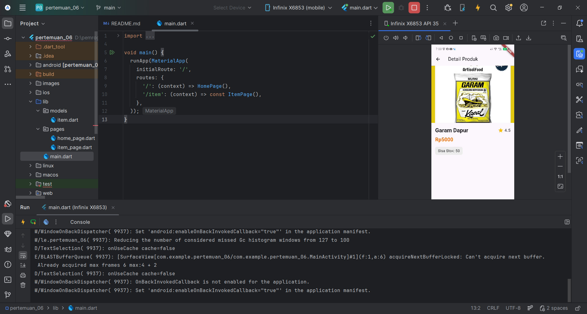

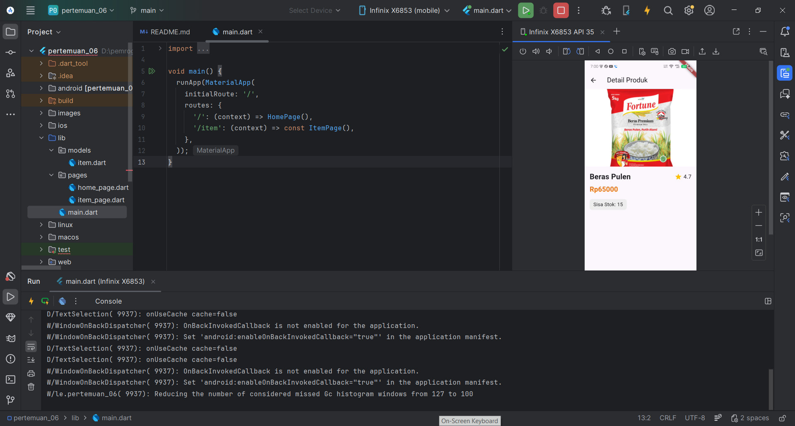

Soal 4, Penerapan widget Hero fungsinya untuk menciptakan efek visual transisi yang mulus seolah-olah gambar produk "terbang" dan membesar dari letaknya di halaman awal menuju posisinya di halaman detail. Cara kerjanya sangat sederhana, yaitu dengan membungkus widget Image pada kedua halaman (home_page.dart dan item_page.dart) menggunakan widget Hero, lalu memberikan properti tag dengan nilai yang sama persis (pada kode ini menggunakan nama produk sebagai pengenal uniknya). Saat kartu produk ditekan dan navigasi dipicu, Flutter akan otomatis mendeteksi kesamaan tag tersebut dan membuat animasi pergerakan gambar antar layar secara otomatis tanpa perlu mengatur koordinat yang rumit.

Soal 5, Disini saya memecah widget panjang di home_page.dart menjadi dua komponen terpisah, yaitu ItemCard (untuk mendesain kartu produk) dan FooterWidget (untuk menampilkan nama dan NIM saya secara permanen di area bawah layar). Tampilan aplikasi kini dipercantik dengan memberikan warna aksen biru seragam, lengkungan pada sudut kartu (BorderRadius), efek bayangan halus (elevation), serta efek tata letak menyisip (overlap) pada halaman detail, sehingga aplikasi tidak hanya fungsional tetapi juga terlihat modern seperti aplikasi marketplace komersial.
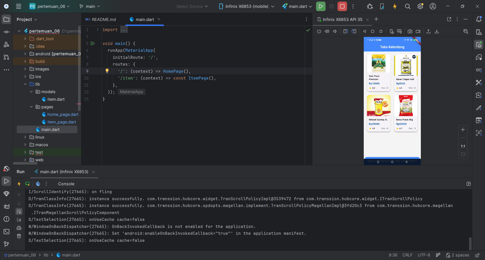
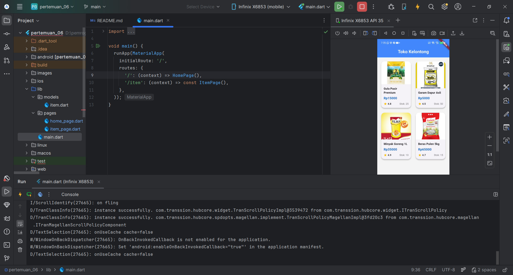
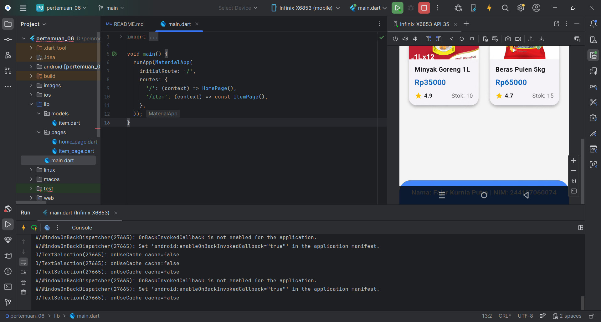
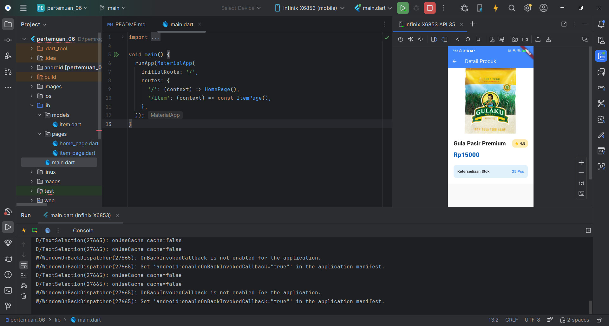
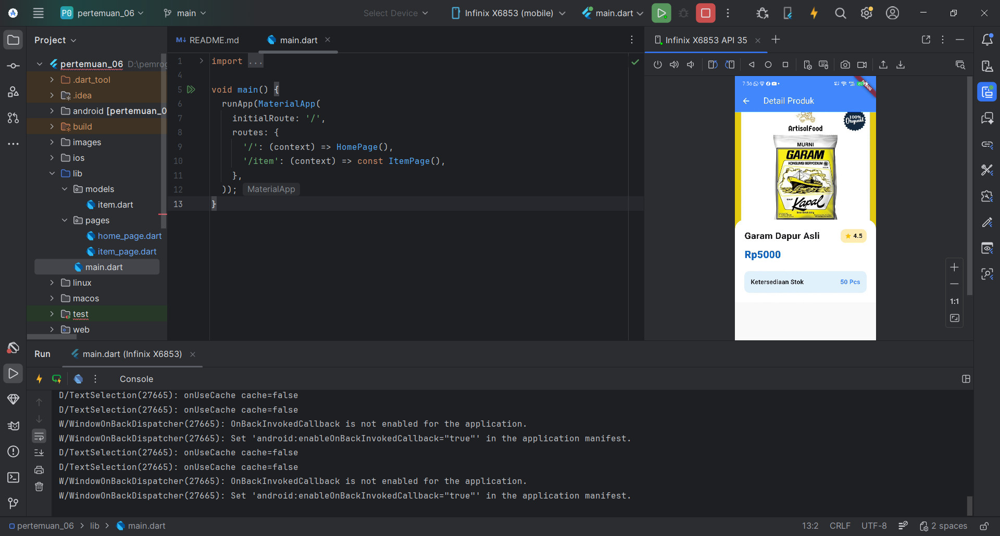
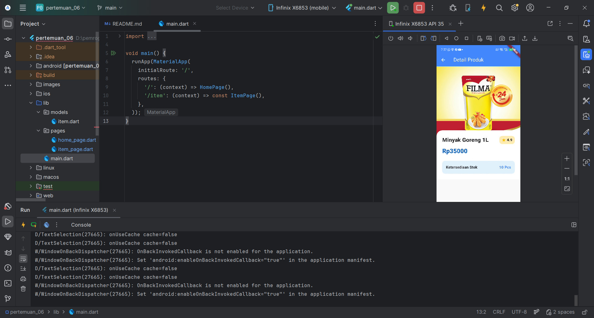
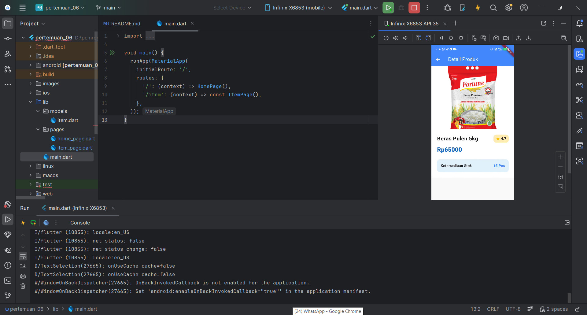

Soal 6, Modifikasi ini mengganti sistem navigasi bawaan Flutter menjadi go_router, sebuah plugin resmi berbasis URL yang lebih modern. Perubahannya berpusat pada file main.dart di mana saya mendaftarkan peta rute (GoRoute) dan mengaktifkan MaterialApp.router, lalu mengubah perintah pindah halaman di home_page.dart menjadi context.go() dengan menyisipkan data melalui properti extra. Selain itu, data produk di halaman item_page.dart kini tidak lagi ditangkap secara pasif menggunakan ModalRoute, melainkan diterima secara langsung dan aman melalui parameter (constructor) kelas yang disalurkan dari konfigurasi rute utama.